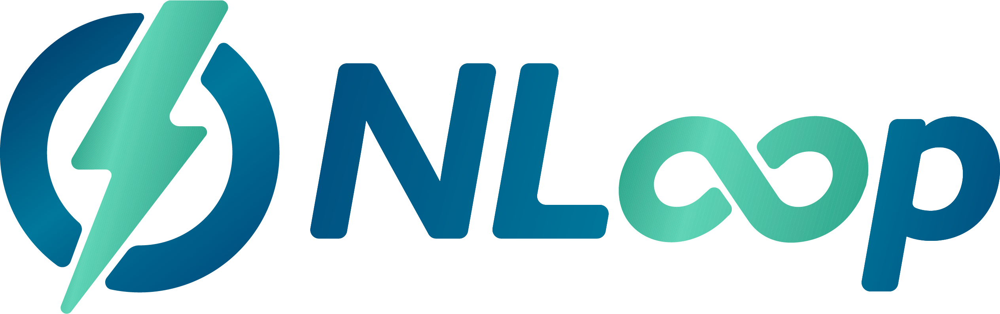

## What is NLoop?

It is a submarine swap client against the [boltz-backend](https://github.com/BoltzExchange/boltz-backend)
Currently it imitates the api of the [lightning loop](https://github.com/lightninglabs/loop).

Read the [anouncement blogpost](https://tech.bitbank.cc/nloop-announcement-en/) for more detail.

## Why use NLoop?

* Supports liquidity management with autoloop (experimental)
* Supports multi-asset swap.
* The server side is [boltz](https://github.com/BoltzExchange/boltz-backend), which is OSS. (Which is not the case for lightning loop.)
* Complete immutable audit log with event-sourcing. Which enables you to easily audit how much you have paied as fee during swaps.
* Minimum trust against the server. It validates every information we get from the server.
* Minimize the direct interaction against the server and instead get the information from the blockchain as much as possible.
* As an real-world example of F#/ASP.NET/DDD/EventSourcing

### Caution:

*NLoop is an open beta: Please use at your own risk. we may introduce backward incompatible changes.*

## How to

### Quick start

We have a two binaries for you to work with.
* `nloopd` ... standalone daemon to perform/manage the submarine swap.
* `nloop-cli` ... command line tool to work with `nloopd` (TBD)

Download the latest binary from [the release page](https://github.com/joemphilips/NLoop/releases)
and run with `--help` to see the possible configuration option.

`nloopd` must connect to following services to work correctly.

1. [bitcoind](https://github.com/bitcoin/bitcoin)
  * or `litecoind` if you want to work with litecoin.
2. [lnd](https://github.com/bitcoin/bitcoin)
3. [EventStoreDB](https://www.eventstore.com/eventstoredb)
  * For saving the application's state.

Probably the best way to check its behaviour is to run it in the regtest.
Check the following guide for how-to.

### How to try `nloopd` with local docker-compose environment in regtest.

Check [README.md in test project](./tests/NLoop.Server.Tests/README.md)

## REST API

Check out our [`openapi.yml`](./openapi.yml) (or [its rendered version](https://bitbankinc.github.io/NLoop/)) for the REST API specification.

### Subscribing to events

If you want to react to the changes caused by nloop, (e.g. notify to slack/discord when the swap starts and/or finished.)
we recommend subscribing to eventstoredb directly rather than long-polling the api.
Please see [the official documentation](https://developers.eventstore.com/clients/dotnet/5.0/subscriptions.html) for how to.
Actual object you get is json-encoded [Events](https://github.com/bitbankinc/NLoop/blob/master/NLoop.Domain/Swap.fs#L299) with metadata.

## configuration options

You can see the complete list of startup configuration options with `--help`
But CLI option is not the only way to specify those variables.
You can also use environment variables start from `NLOOP_`.

e.g. for cli options `--eventstoreurl`, `NLOOP_EVENTSTOREURL` is equivalent.

## Future plans

* [x] loop-in autoloop
* [ ] support interacting with multiple swap-server
* [ ] support swap against lightning-loop-server
* [ ] grpc interface

