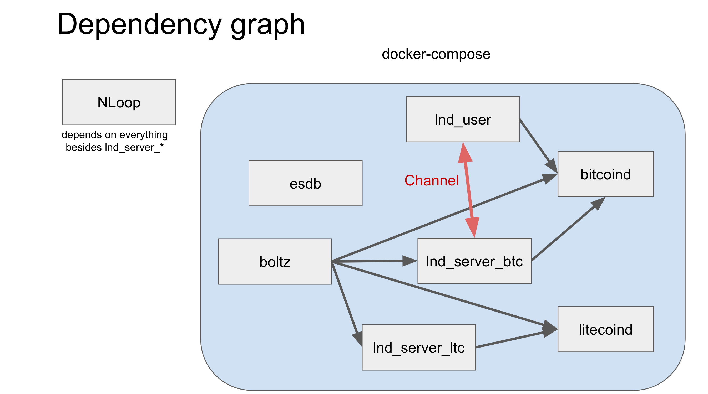

## NLoop Regtest guide (lnd)

This guide walks through the steps to test `nloop` in regtest mode with lnd.

### Service dependencies graph.



### How-to

Note that this requires .NET SDK with compatible version installed.

You also have to enable [docker buildkit](https://docs.docker.com/develop/develop-images/build_enhancements/), by setting

```bash
DOCKER_BUILDKIT=1
COMPOSE_DOCKER_CLI_BUILD=1
```

```sh
# --- prepare dependent services ---
cd tests/NLoop.Server.Tests

docker-compose up -d # Start dependencies such as bitcoind and lnd

# prepare dummy funds for all clients.
./cliutils/prepare_funds.sh

# regtest blockchain is too empty that clients fails to estimate the fee.
# So fill in some dummy tx's and funds by this command, it may take a while to complete.
# This is necessary only for performing an actual swap and not for running the server itself.
./cliutils/prepare_tx_for_fee.sh

./cliutils/open_from_user_to_server.sh

# you can also use these scripts for invoking RPC methods for bitcoind, lnd.
./docker-bitcoin-cli.sh getblockchaininfo
./docker-litecoin-cli.sh getblockchaininfo
./docker-lncli-user.sh getinfo
./docker-lncli-server_ltc.sh getinfo
# Some interactive operation (e.g. lnd's `payinvoice`) may require you to execute it with the pseudo-tty.
# in that case do not use these scripts and run `docker-compose exec` without `-T` option

cd ../..
# --- ---

# --- start running nloopd ---

# You must run this as a same user with a `docker-compose`.
# Since it reads files in `tests/NLoop.Server.Tests/data` generated by the docker-compose command above.
./scripts/start_with_local_docker.sh

# --- ---

# Get general information about NLoop.
curl http://localhost:5000/v1/info
```

Now you can play with [nloop rest api described here](https://bitbankinc.github.io/NLoop/)

You can access http://localhost:2113 for EventStoreDB admin ui to check the current state of the db.

To reset the state, you can just run the following commands after stopping the docker-compose.

```sh
cd tests/NLoop.Server.Tests
docker-compose down
rm -rf data
git checkout -- data
```